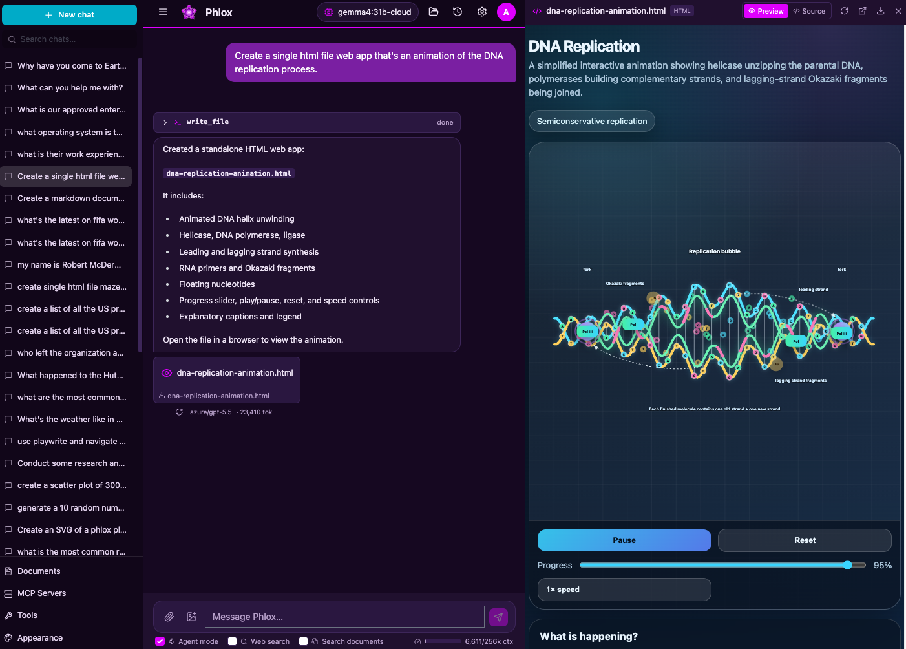

<div align="center">
  
  <h1>Phlox</h1>
  <p>A feature-rich, ChatGPT-style, self-hostable AI assistant.</p>
</div>

Phlox is a self-hostable chat application with an agentic harness, document RAG, code
execution, and MCP integration — running over **any** model provider: **AWS Bedrock** or
**any OpenAI-compatible endpoint** (OpenAI, Ollama, OpenRouter, vLLM, LiteLLM, LM Studio, local
models).



## Features

- 💬 **Streaming chat** with conversation history, rename/delete, search & export, message
  edit/regenerate, markdown with highlighted/copyable code, **Mermaid diagrams** and
  **LaTeX math**.
- 🤖 **Agentic harness** (inspired by PI Coder): the model uses tools in a loop —
  filesystem (`read_file`/`write_file`/`edit_file`/`glob`/`grep`), `run_shell`,
  `execute_python`/`execute_node`, `search_documents`, opt-in live `web_search` +
  `web_fetch`, plus **planning** (`update_todos`), **sub-agents** (`spawn_subagent`),
  **memory** (`save_memory`), and **checkpoints** — each scoped to a per-conversation
  sandboxed workspace.
- 🤝 **Human-in-the-loop approvals** — pause on sensitive tools, approve/deny, resume.
- 🧰 **Code execution** with captured output and **artifacts** shown inline + a
  **Workspace Files** panel to browse/download everything the agent created.
- 🗂️ **Workspace checkpoints** — git-backed snapshots with one-click restore.
- 📚 **Documents / RAG** — upload PDF/DOCX/TXT/MD/code; **hybrid (dense+sparse) search**
  over **Qdrant** with reranking + citations; global or per-conversation scoping. Works
  offline via a fallback embedder.
- 🌐 **Opt-in live web search** — a per-prompt composer toggle exposes `web_search`
  backed by zero-config `ddgs` (or optional SearXNG), so the agent can discover current
  sources before fetching pages with `web_fetch`.
- 🧠 **Cross-conversation memory** — durable facts recalled across chats.
- 🖼️ **Multimodal** — attach images to messages for vision models.
- 🔌 **MCP integration** — connect Model Context Protocol servers; their tools join
  automatically.
- 🔀 **Any provider** — named profiles for Bedrock / OpenAI-compatible endpoints,
  switchable live, with a connection tester.
- 🚪 **OpenAI-compatible API gateway** — mint per-user API keys and call Phlox from any
  OpenAI SDK/tool (`POST /v1/chat/completions`, `GET /v1/models`); every call flows through
  the same per-user/department cost accounting. See [docs/API_GATEWAY.md](docs/API_GATEWAY.md).
- 🏠 **Runs fully local** — point at **Ollama**, **LM Studio**, or **vLLM** (any
  OpenAI-compatible server) for offline, self-hosted inference with no cloud API key; RAG
  embeddings can run locally too.
- 🔐 **Auth & multi-user** — local accounts (or **Entra ID SSO**), `user`/`admin` roles,
  per-user data isolation, an **admin panel** (users, MCP, tools, auth). See
  [docs/AUTH.md](docs/AUTH.md).
- 💵 **Usage & cost accounting** — per-message token/cost in the UI, plus an admin
  **chargeback** view: usage by **month × user × department × model**, CSV export for
  finance, and a durable ledger that keeps a departed user's costs billable after their
  account is deleted. See [docs/OBSERVABILITY.md](docs/OBSERVABILITY.md).
- ⚙️ **Live admin configuration** — edit provider profiles (keys write-only), model
  pricing, resilience, generation defaults, and sandbox limits from an admin-only
  **Configuration** panel, applied without a server restart. `config.yml` remains the seed.
- 📦 **Container sandbox** — run code in an isolated **Podman/Docker** container with
  resource limits + network isolation. See [docs/SANDBOX.md](docs/SANDBOX.md).
- 🎨 **Theming** — Phlox Dark (default) + Phlox Light/Light/Dark/Fred Hutch/Hutch
  Night/Sandstone/**Terminal** (CRT phosphor-green), instant switching. See
  [docs/THEMING.md](docs/THEMING.md).
- 🛡️ **Per-tool permissions** — `auto | ask | deny`, with an "Agent mode" toggle.
  Live web search is a separate per-prompt toggle and is off by default.

## Documentation

| Doc | What it covers |
|---|---|
| [docs/ARCHITECTURE.md](docs/ARCHITECTURE.md) | System map, request lifecycle, module guide — **start here** |
| [docs/ROADMAP.md](docs/ROADMAP.md) | What's done and what's next (Tiers 1–5) |
| [docs/DEPLOYMENT.md](docs/DEPLOYMENT.md) | Production deployment on Linux (Ubuntu/RHEL) under **systemd** |
| [docs/DOCKER.md](docs/DOCKER.md) | Running Phlox in a container (**Docker or Podman**) |
| [docs/AUTH.md](docs/AUTH.md) | Local accounts, roles, multi-user isolation, **Entra ID SSO** setup |
| [docs/SANDBOX.md](docs/SANDBOX.md) | Local vs **Podman/Docker container** code-execution sandbox |
| [docs/OBSERVABILITY.md](docs/OBSERVABILITY.md) | Token usage/cost, structured logs, OpenTelemetry tracing |
| [docs/API_GATEWAY.md](docs/API_GATEWAY.md) | OpenAI-compatible API gateway: API keys + `/v1/*` endpoints |
| [docs/MCP.md](docs/MCP.md) | Connecting MCP servers |
| [docs/THEMING.md](docs/THEMING.md) | The theme token system + adding themes |
| [docs/ADDING_A_TOOL.md](docs/ADDING_A_TOOL.md) · [docs/ADDING_A_PROVIDER.md](docs/ADDING_A_PROVIDER.md) | Extension guides |
| [AGENTS.md](AGENTS.md) | Orientation for AI coding agents working on the repo |

## Architecture

Two processes: a **FastAPI** backend (LLM orchestration, agent harness, MCP, RAG, code
exec, auth, SQLite persistence) and a **React/Vite** frontend. Full details in
**[docs/ARCHITECTURE.md](docs/ARCHITECTURE.md)**.

```
backend/   FastAPI app (app/), config.yml, SQLite + Qdrant under data/
frontend/  React + Vite + Tailwind SPA
docs/      ARCHITECTURE, ROADMAP, DEPLOYMENT, DOCKER, AUTH, SANDBOX, MCP, THEMING, ADDING_A_*
scripts/   dev.ps1 / dev.sh
```

## Quick start

Prerequisites: **Python 3.11+** with [`uv`](https://docs.astral.sh/uv/), **Node 18+**, and
a model provider (a local [Ollama](https://ollama.com) is the easiest).

```bash
# 1. Backend
cd backend
uv sync
cp config.yml.example config.yml        # edit: set your provider profile(s)
uv run uvicorn app.main:app --reload --port 8000

# 2. Frontend (separate terminal)
cd frontend
npm install
npm run dev                              # open http://localhost:5173
```

On Windows you can run both with `./scripts/dev.ps1`; on macOS/Linux `./scripts/dev.sh`.

### Configure a provider

Edit `backend/config.yml` (full examples in `config.yml.example`). Any
**OpenAI-compatible** server works with `type: openai` — just point `endpoint` at it. That
covers the popular **local** runtimes, so Phlox can run **entirely offline** with no
cloud API key:

```yaml
default_profile: local-ollama
profiles:
  local-ollama:
    type: openai
    label: "Ollama (local)"
    endpoint: http://localhost:11434/v1
    api_key: ollama            # required by the client, ignored by Ollama
    model: qwen3.6:35b
    # Optional: restrict/seed the model dropdown. If omitted, /api/providers
    # tries to list models from the endpoint.
    models: [qwen3.6:35b, glm-4.7-flash:latest]
    supports_tools: true       # set false for models without tool-calling

  # LM Studio (local) — enable its server under the "Developer" tab (default port 1234).
  lmstudio:
    type: openai
    label: "LM-Studio (local)"
    endpoint: http://localhost:1234/v1
    api_key: none            # required by the client, ignored by LM-Studio
    model: qwen/qwen3.6-27b
    # Optional: restrict/seed the model dropdown. If omitted, /api/providers
    # tries to list models from the endpoint.
    models: [qwen/qwen3.6-27b]
    supports_tools: true       # set false for models without tool-calling
```

The same `type: openai` shape also covers **OpenAI**, **LiteLLM**, and any other
OpenAI-compatible gateway — set the `endpoint` and `api_key`. For **AWS Bedrock**, use
`type: bedrock` with a `model` id and `aws_region` (credentials resolve via the standard
AWS chain; for temporary STS creds also set `aws_session_token`).

Define as many profiles as you like and switch between them live in **Settings → Model**
(there's a built-in connection tester). Embeddings for document RAG can also run locally —
e.g. Ollama's `nomic-embed-text` — so the whole stack stays offline.

> **Edit config without a restart.** `config.yml` is the seed; an admin can edit provider
> profiles, model pricing, resilience, generation defaults, and sandbox limits **live** in
> **Settings → (Admin) Configuration** (overrides are stored in the DB and applied
> immediately). API keys there are write-only/masked. Bootstrap-sensitive settings (`auth`,
> `vector_store`, the sandbox runner *type*, OTel) stay file-only and need a restart. See
> [docs/AUTH.md](docs/AUTH.md) §admin config.

### Sign in

Auth is **on by default** with a seeded admin: **`admin` / `admin`**. Manage users, reset
passwords, and view/configure SSO under **Settings → (Admin) Users / Authentication**.
**Change the default admin password and set a real `auth.jwt_secret`** before sharing
access — see [docs/AUTH.md](docs/AUTH.md). To run single-user with no login, set
`auth.enabled: false`.

### Code-execution sandbox

By default code runs in a **local subprocess** (fast, trusts the host). For isolation, set
`sandbox.runner: container` to run each execution in an ephemeral **Podman/Docker**
container with CPU/memory/PID limits and network isolation — see [docs/SANDBOX.md](docs/SANDBOX.md).

## Production build

```bash
cd frontend && npm run build      # outputs frontend/dist
cd ../backend && uv run uvicorn app.main:app --port 8000
```
FastAPI serves the built SPA from `frontend/dist` at `/`.

## Testing

The backend has a pytest suite (unit + FastAPI `TestClient` API tests + scripted-provider
agent-loop/fallback tests); the frontend is verified by a production build. The same checks
run in **GitHub Actions CI** (`.github/workflows/ci.yml`) on every push/PR.

```bash
# Backend: lint + tests (from backend/)
cd backend
uv sync --extra dev          # installs ruff + pytest
uv run ruff check app tests
uv run pytest                # or: uv run pytest -k usage   to run a subset

# Frontend: the CI check is the build (from frontend/)
cd ../frontend && npm run build
```

The tests run against an in-memory/temp SQLite DB with `auth.enabled` off (a synthetic dev
admin), so no provider credentials or network are needed — agent-loop tests use a built-in
**scripted "test" provider**. Coverage includes the chargeback ledger surviving user
deletion (`tests/test_api.py::test_usage_ledger_survives_user_deletion`).

### Live-model evals (optional)

`backend/evals/run_evals.py` exercises the agent against a **real** configured provider
(tool use, RAG, multi-step). It needs a working `config.yml` profile and is **not** part of
CI:

```bash
cd backend && uv run python -m evals.run_evals
```

## Security notes

- **Auth:** change the seeded `admin`/`admin` and set a strong `auth.jwt_secret` (env
  `PHLOX_JWT_SECRET`) before any shared use. Data is isolated per user; admin features
  are role-gated.
- **Sandbox:** the local runner trusts the host (fine for single-user/local). For
  untrusted/multi-user execution use `sandbox.runner: container` ([docs/SANDBOX.md](docs/SANDBOX.md)).
- Mutating/execution tools default to the **`ask`** permission policy; "Agent mode"
  auto-approves for a turn.
- **Sensitive data (PHI):** Postgres, audit logging, secrets management, and data
  governance are tracked as **Tier 5** in the [roadmap](docs/ROADMAP.md) and are required
  before any deployment touching sensitive data.

## License

Licensed under the **Apache License, Version 2.0** — see [LICENSE](LICENSE).
Copyright © 2026 Robert McDermott &lt;robert.c.mcdermott@gmail.com&gt;.
