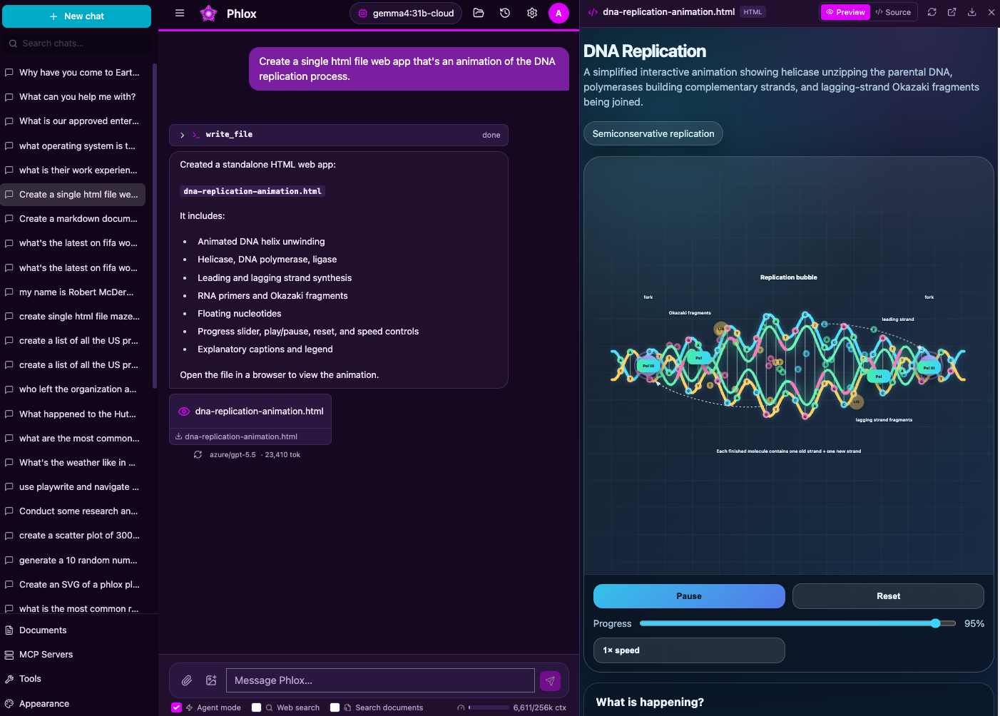

<div align="center">
  
  <h1>Phlox</h1>
  <p>A feature-rich, ChatGPT-style, self-hostable AI assistant.</p>

  <p>
    <a href="https://github.com/robert-mcdermott/phlox/actions/workflows/ci.yml"></a>
    <a href="https://codecov.io/gh/robert-mcdermott/phlox"></a>
    <a href="https://www.codefactor.io/repository/github/robert-mcdermott/phlox"></a>
    <a href="LICENSE"></a>
  </p>
</div>

Phlox is a self-hosted AI assistant for conversation, document research, and tool-assisted
work. Connect AWS Bedrock or an OpenAI-compatible endpoint, including local model servers
such as Ollama, LM Studio, and vLLM. Model capabilities depend on the selected provider.

**[User Guide](docs/USER_GUIDE.md)** — installation, first login, providers, configuration,
everyday use, upgrades, and troubleshooting.



## Features

- **Local and cloud models** — connect Ollama, LM Studio, vLLM, OpenAI-compatible services,
  or AWS Bedrock. [Discover available models](docs/MODEL_DISCOVERY.md) in a searchable picker
  and switch provider profiles without leaving the app; use local inference and embeddings
  without a cloud API key.
- **Agentic workflows** — planning, delegated sub-agents, filesystem and shell tools, with
  per-tool permissions, human approvals, and Git-backed workspace checkpoints.
- **Code execution and artifacts** — run Python and JavaScript, inspect generated files,
  charts, and captured output, and preview HTML/Markdown in a resizable artifact canvas.
  [Edit text artifacts](docs/ARTIFACTS.md), revise selected passages with AI, compare versions,
  and restore earlier work.
  Choose local execution, isolated Docker/Podman containers, or AWS AgentCore microVMs.
- **Document and web research with citations** — search PDFs, Word documents, Markdown,
  and code, or discover and read web pages. Inspect the retained passage behind each
  [citation](docs/SOURCES.md), including document locations or web URLs and fetch times.
  Choose [Research mode](docs/RESEARCH.md) for a bounded plan, evidence gathering, and report;
  configure Serper or public SearXNG search in the admin console, with DuckDuckGo fallback.
- **Reconnectable runs** — optional [persistent execution](docs/RUNS.md) continues across
  browser refreshes and chat switches, with explicit Stop, saved approvals, and recovery.
- **Custom assistants and skills** — create specialized assistants with their own prompts,
  knowledge bases, and capabilities. Invoke reusable [skills](docs/SKILLS.md) with slash
  commands or let the agent discover relevant workflows.
- **Conversation alternatives** — retry answers and revise prompts without losing earlier
  conversations, evidence, or saved output. [Explore alternatives](docs/CONVERSATION_ALTERNATIVES.md).
- **Projects and visible context** — organize ongoing work in private [projects](docs/PROJECTS.md)
  with selected documents and shared instructions. Review context before sending and inspect
  retained passages supplied to model calls afterward.
- **Cross-conversation memory** — save useful facts and preferences for recall in future
  chats, with a Memory panel to review and manage them.
- **MCP and API integration** — connect external tools through the Model Context Protocol,
  or use Phlox's [OpenAI-compatible API gateway](docs/API_GATEWAY.md) with per-user API keys.
- **Multi-user access and controls** — private user data, local accounts or Entra ID SSO,
  role-based administration, and configurable PII redaction and blocking.
- **Usage, budgets, and administration** — inspect token usage and known/unknown costs,
  track spending by user, department, and model, set monthly budgets, and edit provider
  profiles and supported configuration live.
- **Rich chat and personalization** — image input for vision models, highlighted code,
  LaTeX math, Mermaid diagrams, editable messages, conversation search/export, and
  [18 color themes](docs/THEMING.md), from Phlox Dark to Outrun, Blade Runner 2049, and Nord.

## Quick start

For a local installation, have Git, **uv**, Python **3.11+**, Node/npm (the repository's CI
uses Node **20**), and a reachable model provider. From your checkout:

```bash
git clone https://github.com/robert-mcdermott/phlox.git
cd phlox
./scripts/start.sh dev
```

On Windows PowerShell, run `.\scripts\start.ps1 dev` instead. The launcher installs project
dependencies, creates `backend/config.yml` if absent, and opens **http://localhost:5173**.
It does not install a model server or download models. Edit the example profiles to match
your provider; see [first-time setup](docs/USER_GUIDE.md#first-time-setup).

On a fresh database, use the temporary admin password printed at startup, then replace it
at first login. Stop with Ctrl+C or `./scripts/stop.sh` (Windows: `.\scripts\stop.ps1`).
Existing installations should follow [the upgrade steps](docs/USER_GUIDE.md#upgrades-and-backups)
before starting new code.

To let chat work continue across refreshes, add this top-level setting to your config and
restart. It is off by default and is independent of Agent mode:

```yaml
runs:
  enabled: true
```

With runs enabled, closing a tab does not stop execution; use the chat's **Stop** button.
See [RUNS.md](docs/RUNS.md) for behavior, limits, and recovery.

## Deploy and configure

The local runner executes code with the host application's access. For shared use, choose
an isolated runner. The `prod` launcher requires a stable `PHLOX_JWT_SECRET` and an isolated
runner when authentication is enabled; it is not a drop-in first-run shortcut. Run one
Phlox application process per database/data directory, including with Postgres.

| Guide | Start here for |
|---|---|
| [User Guide](docs/USER_GUIDE.md) | Setup, configuration precedence, usage, troubleshooting, and all feature guides |
| [Linux deployment](docs/DEPLOYMENT.md) | systemd, production configuration, reverse proxy and TLS |
| [Docker / Podman](docs/DOCKER.md) | Application image, persistent mounts, provider networking and sandbox choices |
| [Backup and restore](docs/BACKUP_RESTORE.md) | Existing databases, migrations, offline backups and recovery |
| [Architecture](docs/ARCHITECTURE.md) · [Development](docs/DEVELOPMENT.md) | Code navigation, extensions and verification |
| [Roadmap](docs/ROADMAP.md) · [Delivered waves](docs/IMPLEMENTATION_WAVES.md) | Planned improvements and verified delivery status |

Local inference can keep model requests on your own machines; cloud profiles, web tools,
MCP services, embeddings, and remote execution can send data elsewhere. Choose these
connections deliberately. Regulated/sensitive-data governance remains a separate deployment
track in the roadmap.

## License

Licensed under the **Apache License, Version 2.0** — see [LICENSE](LICENSE).
Copyright © 2026 Robert McDermott &lt;robert.c.mcdermott@gmail.com&gt;.
